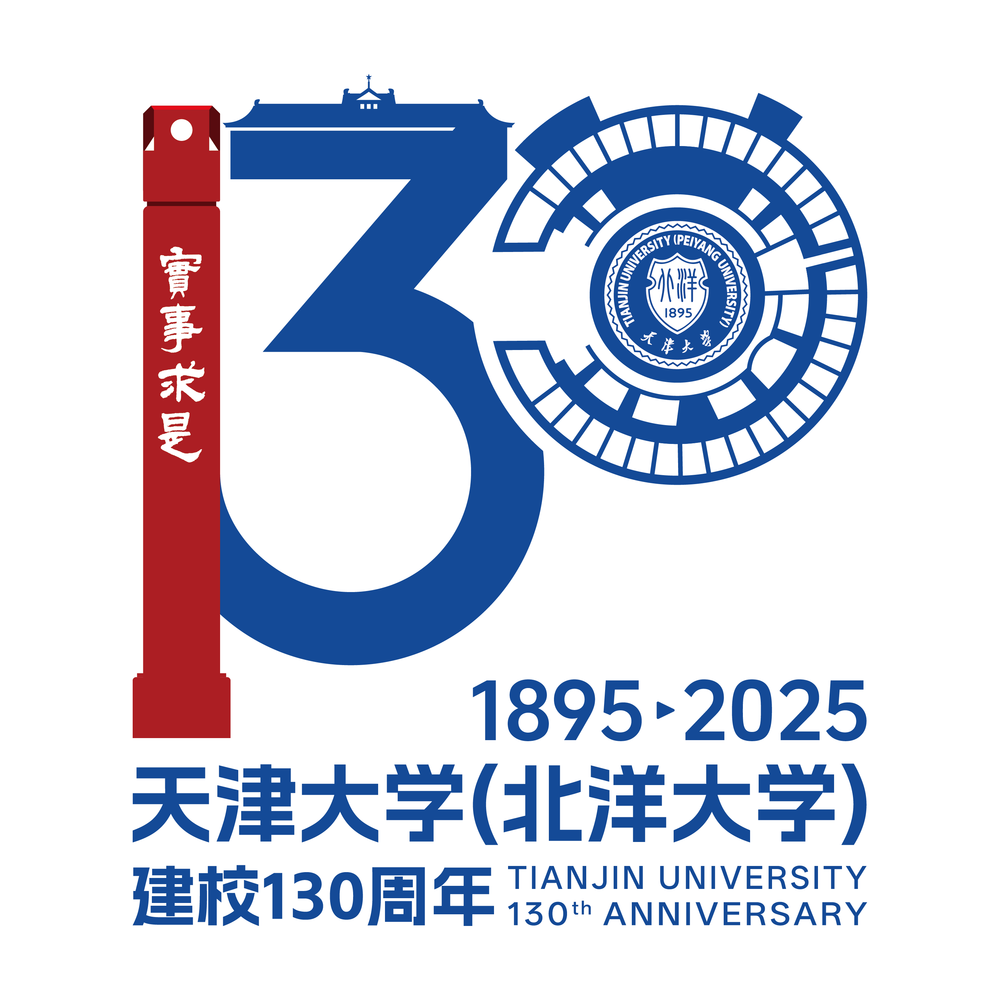

# 🐒 OSKernel2025-MonkeyOS
<div align="center">
  
</div>
<div align="center">
  
  
</div>

> 该操作系统内核基于[ByteOS](https://github.com/Byte-OS/ByteOS)进行二次开发，感谢河南科技大学在ByteOS项目中展现出的开源精神与卓越贡献，为开源操作系统的发展注入了宝贵力量。

## 🎯 项目介绍
MonkeyOS是在[ByteOS](https://github.com/Byte-OS/ByteOS)的基础上进行二次开发的操作系统内核项目。

MonkeyOS做出的改进主要包括：
- loongarch与risc-v多架构支持的进一步完善
- 多C标准库的动态支持
- 系统调用的进一步增添、完善
- 修复、完善原内核存在的问题，适配赛事测试样例

## 📕 项目文档
Monkey初赛技术文档在"./doc"目录下存储

PPT与视频见网盘：天津大学_Moncake
链接: https://pan.baidu.com/s/118UkAn8sVSEzRdByz9EfxQ 提取码: 1895

## 🚀 项目结构
该项目采用 Rust 语言开发，包含以下主要模块：

- kernel：操作系统的核心部分，负责系统初始化、任务调度、内存管理等功能。
- driver：硬件驱动程序，包括对输入设备、显示器、存储设备等的支持。
- filesystem：文件系统实现，提供文件读写、目录管理等功能。
- crates：共享库和工具集，供其他模块使用。
- vendor：第三方依赖库。

## 🏠 环境要求
- Rust 编译链（Risc-V与Loongarch）
- QEMU 等支持多种指令集架构（尤其支持Loongarch）的虚拟机

## 📦 编译与运行方式
编译本项目：
```shell
make all
```

在QEMU中运行Risc-V指令集架构内核
```shell
qemu-system-riscv64 -machine virt -kernel kernel-rv -m 1G -nographic -smp 1 -bios default -drive file=sdcard-rv.img,if=none,format=raw,id=x0 -device virtio-blk-device,drive=x0,bus=virtio-mmio-bus.0 -no-reboot -device virtio-net-device,netdev=net -netdev user,id=net -rtc base=utc
```

在QEMU中运行Loongarch指令集架构内核
```shell
qemu-system-loongarch64 -kernel kernel-la -m 1G -nographic -smp 1 -drive file=sdcard-la.img,if=none,format=raw,id=x0 -device virtio-blk-pci,drive=x0 -no-reboot -device virtio-net-pci,netdev=net0 -netdev user,id=net0 -rtc base=utc
```

## 📄 许可证
本项目采用 MIT 许可证，详情请参阅 LICENSE 文件。